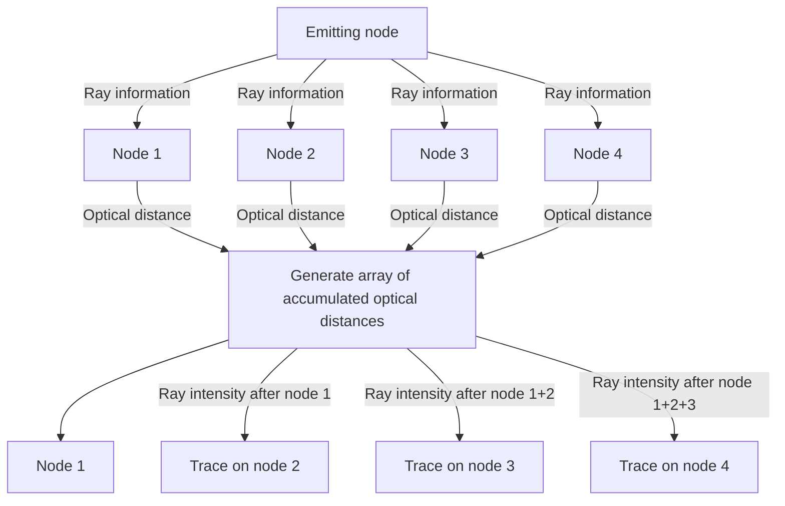
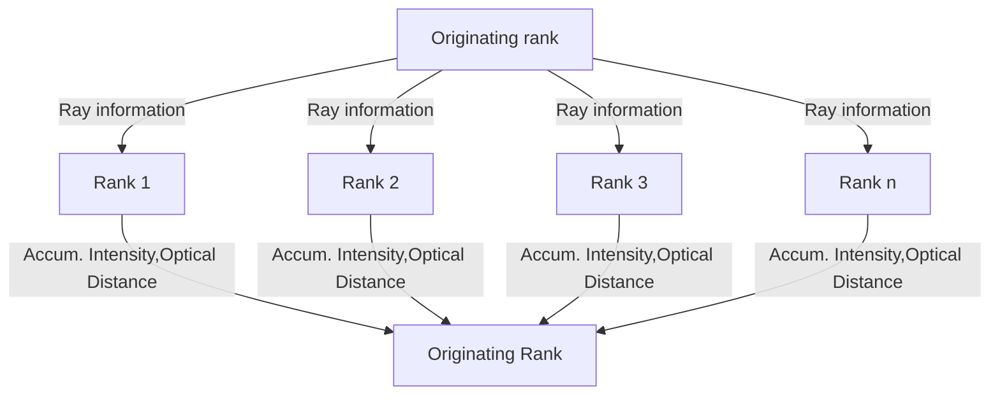
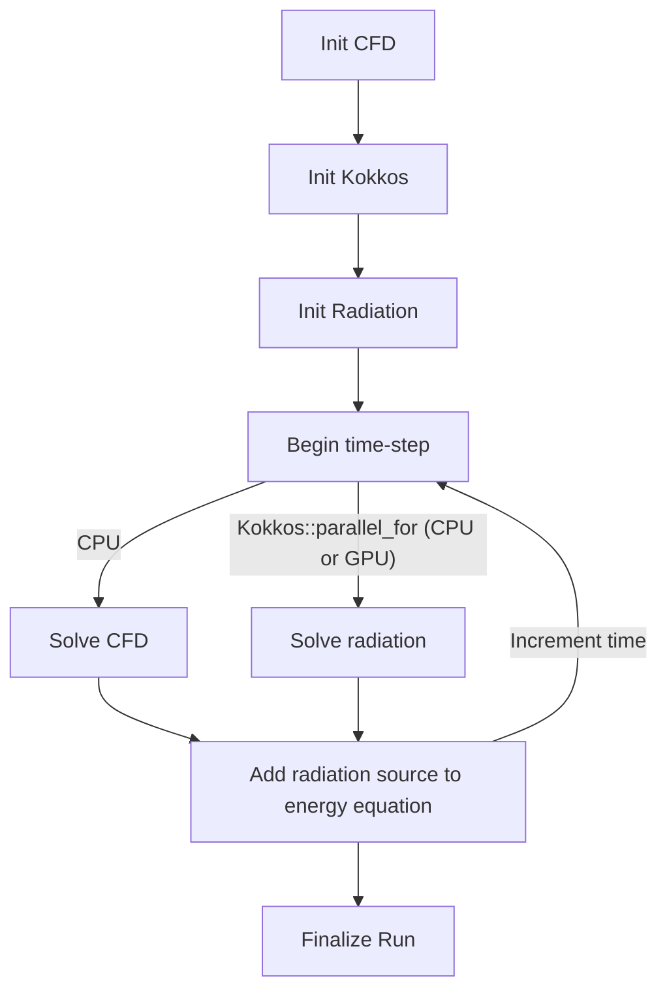
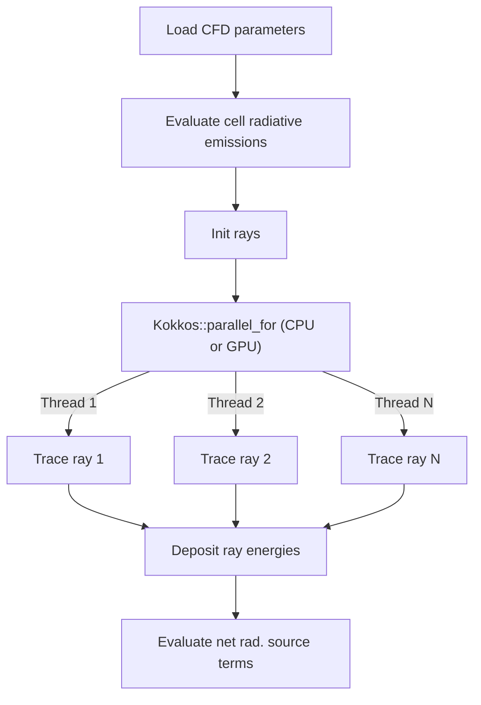

# MCRT_Thesis_Tricard

## Two-pass implementation (forward MC):

```mermaid
graph TD
    A[Emitting node] -->|Ray information| B[Node 1]
    A -->|Ray information| C[Node 2]
    A -->|Ray information| D[Node 3]
    A -->|Ray information| E[Node 4]
    B -->|Optical distance| F[Generate array of accumulated optical distances]
    C -->|Optical distance| F
    D -->|Optical distance| F
    E -->|Optical distance| F
    F --> G[Node 1]
    F -->|Ray intensity after node 1| H[Trace on node 2]
    F -->|Ray intensity after node 1+2| I[Trace on node 3]
    F -->|Ray intensity after node 1+2+3| J[Trace on node 4]
```

## Single-pass (backwards MC):

```mermaid
graph TD
    A[Originating rank] -->|Ray information| B[Rank 1]
    A -->|Ray information| C[Rank 2]
    A -->|Ray information| D[Rank 3]
    A -->|Ray information| E[Rank n]
    B -->|Accum. Intensity,Optical Distance| F[Originating Rank]
    C -->|Accum. Intensity,Optical Distance| F
    D -->|Accum. Intensity,Optical Distance| F
    E -->|Accum. Intensity,Optical Distance| F
```

## CFD-rad flow chart

```mermaid
graph TD
    A[Init CFD] -->B[Init Kokkos]
    B --> H[Init Radiation]
    H --> C[Begin time-step]
    C --> |CPU| D[Solve CFD]
    C --> |"Kokkos::parallel_for (CPU or GPU)"| E[Solve radiation]
    D --> F[Add radiation source to energy equation]
    E --> F
    F --> |Increment time| C
    F --> G[Finalize Run]
  
```

## Rad flow chart

```mermaid
graph TD
    A[Load CFD parameters] --> B[Evaluate cell radiative emissions]
    B --> H[Init rays]
    H --> C["Kokkos::parallel_for (CPU or GPU)"]
    C --> |Thread 1| D[Trace ray 1]
    C --> |Thread 2| E[Trace ray 2]
    C --> |Thread N| F[Trace ray N]
    D --> G[Deposit ray energies]
    E --> G
    F --> G
    G --> I[Evaluate net rad. source terms]
    
```

