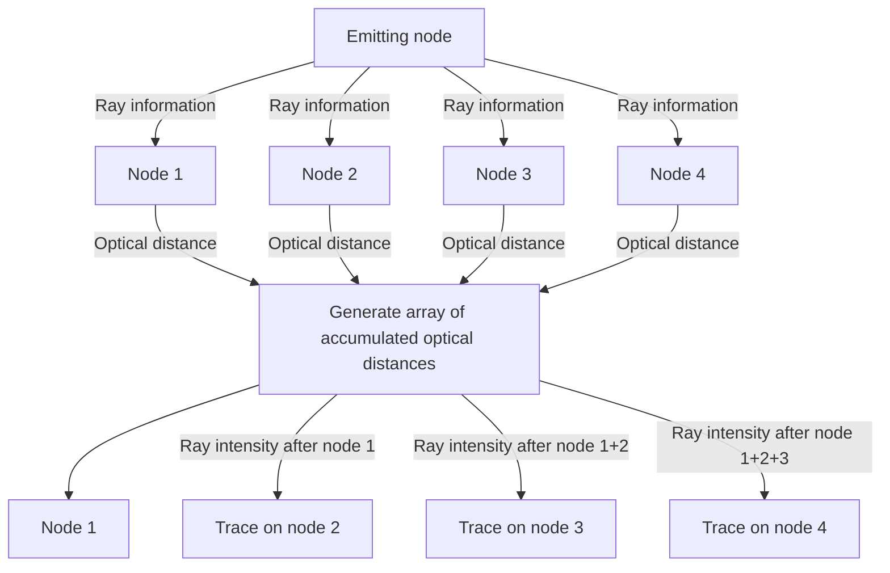
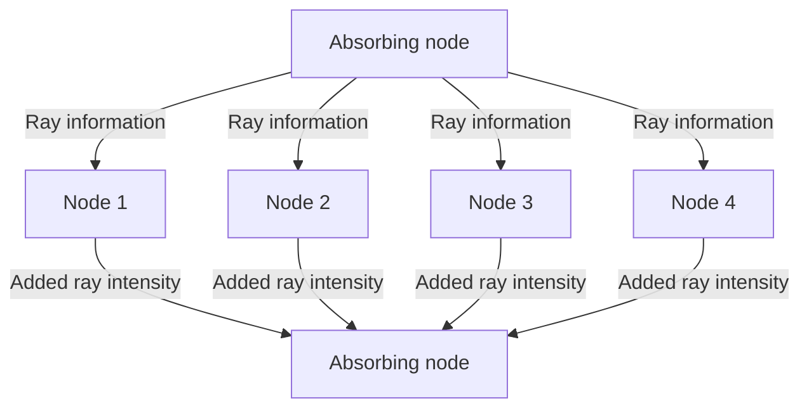

# MCRT_Thesis_Tricard

## Two-pass implementation (forward MC):

```mermaid
graph TD
    A[Emitting node] -->|Ray information| B[Node 1]
    A -->|Ray information| C[Node 2]
    A -->|Ray information| D[Node 3]
    A -->|Ray information| E[Node 4]
    B -->|Optical distance| F[Generate array of accumulated optical distances]
    C -->|Optical distance| F
    D -->|Optical distance| F
    E -->|Optical distance| F
    F --> G[Node 1]
    F -->|Ray intensity after node 1| H[Trace on node 2]
    F -->|Ray intensity after node 1+2| I[Trace on node 3]
    F -->|Ray intensity after node 1+2+3| J[Trace on node 4]
```

## Single-pass (backwards MC):

```mermaid
graph TD
    A[Absorbing node] -->|Ray information| B[Node 1]
    A -->|Ray information| C[Node 2]
    A -->|Ray information| D[Node 3]
    A -->|Ray information| E[Node 4]
    B -->|Added ray intensity| F[Absorbing node]
    C -->|Added ray intensity| F
    D -->|Added ray intensity| F
    E -->|Added ray intensity| F
```
